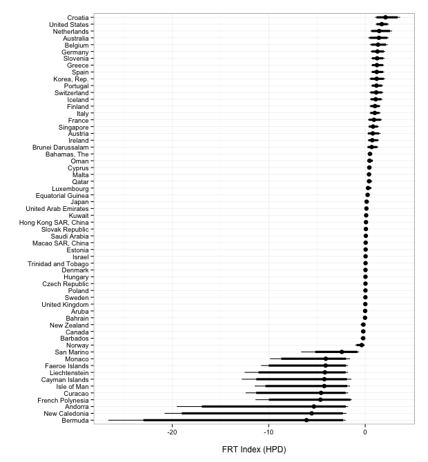

Financial Regulatory Transparency Index
========

Financial Regulatory Transparency (FRT) Index, as well as documentation and source code to create the Index.

**Version:** 0.1

**Maintainer:** [Christopher Gandrud](http://christophergandrud.blogspot.de/p/biocontact.html)

Funding generously provided by the [Deutsche Forschungsgemeinschaft](http://www.dfg.de/en/).

**This is a work in progress. Only Beta Release.**

---


## Index Data

The current draft version of the index is located in the *IndexData* directory. The current version is in a CSV formatted file called: [FRTIndex_v0_1.csv](https://raw.githubusercontent.com/FGCH/FRTIndex/master/IndexData/FRTIndex_v0_1.csv).

It covers the **60 countries** classified by the World Bank as '**High Income**' and the years **1998 through 2011**.

#### FRT Index Scores for 2011



The file `FRTIndex_v0_1.csv` contains the following variables:

| Variable Name | Short Description                              |
| ------------- | ---------------------------------------------- |
| country       | country name                                   |
| iso2c         | [ISO 2 letter country code](http://en.wikipedia.org/wiki/ISO_3166-1_alpha-2) |
| year          | year of the FRT score                          |
| lower_95        | lower bound of the 95% credibility interval    |
| lower_90        | lower bound of the 90% credibility interval    |
| median        | median of the FRT index posterior distribution |
| upper_90      | upper bound of the 90% credibility interval    |
| upper_95      | upper bound of the 95% credibility interval    |

## Download into R

To download the Index directly into R use the [repmis](http://cran.r-project.org/web/packages/repmis/index.html) package:

```{S}
URL <- 'https://raw.githubusercontent.com/FGCH/FRTIndex/master/IndexData/FRTIndex_v0_1.csv'

frt_index <- repmis::source_data(URL)
```

## Model

The FRT Index is created using a [Bayesian Item Response Theory](http://en.wikipedia.org/wiki/Item_response_theory) model of high income countries's reporting of financial industry indicators to the World Bank's [Global Financial Development Database](http://data.worldbank.org/data-catalog/global-financial-development).

A full write up of our model is in the works. The most recent (incomplete) draft is available for download as a [PDF](https://github.com/FGCH/FRTIndex/blob/master/paper/FRTIndexPaper.pdf?raw=true).

The estimation model is based on:

> Hollyer, James R., B. Peter Rosendorff, and James Raymond Vreeland. 2014. "Replication data for: Measuring Transparency". 
[http://dx.doi.org/10.7910/DVN/24274](http://dx.doi.org/10.7910/DVN/24274)

---

<a href="http://www.dfg.de/en/"></a> 

<a rel="license" href="http://creativecommons.org/licenses/by-sa/4.0/"></a>