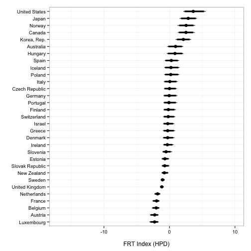
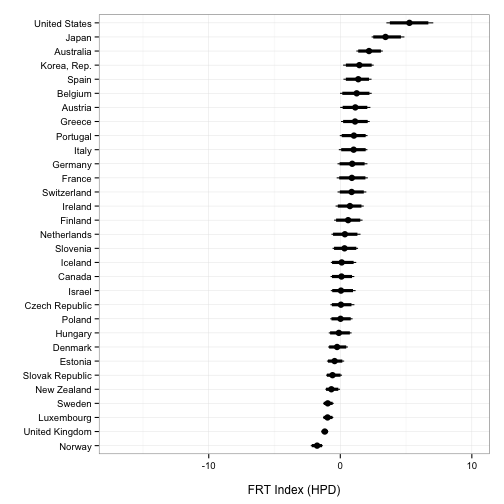
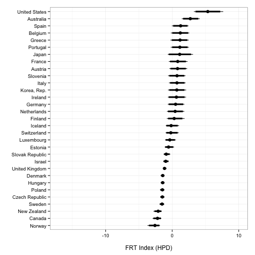

# Financial Regulatory Transparency Index Robustness Check: Estimating with only OECD countries

To examine the robustness of the Financial Regulatory Transparency Index estimates we estimated the FRT with only OECD member states. Perhaps outliers countries are driving the estimates. For example, off-shore financial havens have very low transparency and report very few items. A number of countries are classified by the World Bank as 'high income' due to having high oil revenues, but small populations, such as Equatorial Guinea and Oman. These countries have could have low financial sector administrative capacity and less developed financial sectors generally. Their inclusion may be bias the FRT, such that it captures a lack of administrative capacity or a lack of financial sector development, rather than transparency. Estimating the FRT Index with only OECD countries allows us to examine if the inclusion of extremely nontransparent countries or countries with low administrative capacity and/or less developed financial sectors creates these biases.

Estimating the FRT Index using only OECD members did not substantively change the Index estimates for the included countries. The following figures show the FRT Index estimates from a model using only OECD members for the years 1998, 2007, and 2011. They mirror those in the FRT Index write up paper. The general order of the countries is the same, within the estimated range of uncertainty. The range of the Index is also generally similar as the same set of countries cover when estimated with the full sample, though it is shifted slightly downward and there is some more differentiation at the upper end, especially for the United States in 2011. 

### Figure 1: Financial Regulatory Transparency Index in 1998 (OECD robustness check)

### Figure 2: Financial Regulatory Transparency Index in 2007 (OECD robustness check)

### Figure 3: Financial Regulatory Transparency Index in 2011 (OECD robustness check)

